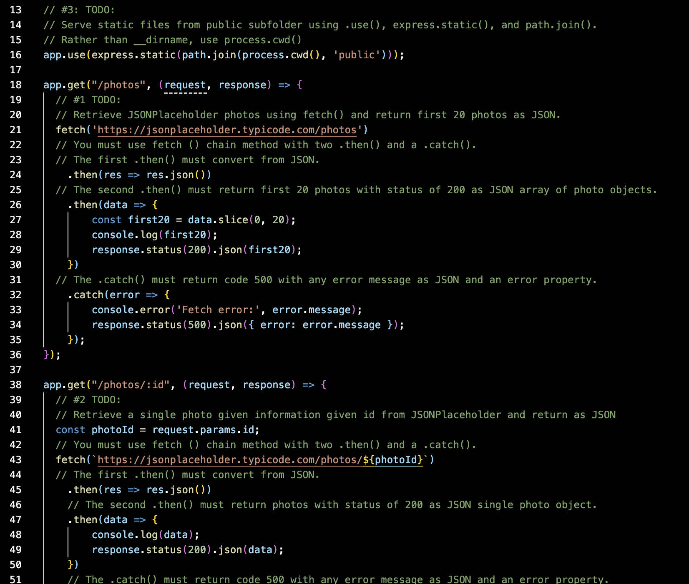

# Lab 8 - Express API + Fetch 

## Purpose
This lab focused on building a simple RESTful API using Express.js. The server returned photo data retrieved using `fetch()` and served a frontend to display the results.

## Technologies Used
- Node.js
- Express.js
- Fetch API
- HTML, CSS, JS (frontnd)

## What I Learned 
- How to build an API with Express
- How to serve static files
- How to use `fetch()` with `.then()` and `.catch()` in Node and browser

